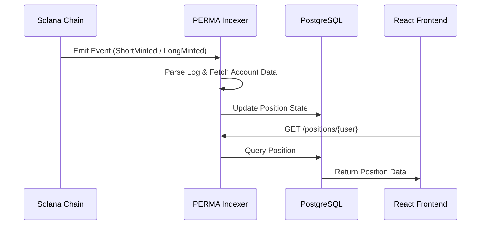

# OFFCHAIN ARCHITECTURE: PERMA

> **Aspirational — P2.** The indexer → PostgreSQL → API pipeline below is the post-MVP product stack ([`docs/09-post-mvp/INDEXER-AND-PRODUCT-UI.md`](../09-post-mvp/INDEXER-AND-PRODUCT-UI.md)). Fair MVP ships **no** off-chain service: the web app polls RPC and, after each transaction it sends, decodes that transaction's events to refetch what changed (`apps/web/src/lib/events.ts`; component 11, [`11-events-indexing.md`](../02-mvp-components/11-events-indexing.md)). The direct-RPC fallback rule in §UI Integration Strategy is the one part of this page that is live today.

## System Topology
The off-chain stack is designed for low latency and a premium user experience, moving away from "raw RPC" calls toward a cached, indexed state.

## The Stack
- **Frontend**: Next.js 14 (App Router), TypeScript, Tailwind CSS.
- **State Management**: Zustand (for global wallet/portfolio state).
- **Blockchain Interface**: `@solana/web3.js`, `@coral-xyz/anchor`.
- **Indexer**: Node.js / PostgreSQL (listening for program events).
- **API**: Fastify / Express (serving cached state to the frontend).

## Data Flow: The Indexing Pipeline

## UI Integration Strategy
To avoid the "slow RPC" feel, the UI follows these rules:
1. **Optimistic Updates**: When a user trades, the UI immediately updates the portfolio state, then reconciles once the transaction is `finalized`.
2. **Polling vs. Websockets**: Use Websockets for transaction notifications and polling for premium accrual updates.
3. **Direct RPC Fallback**: For critical balance checks before a trade, the UI bypasses the indexer and reads the `UserCollateral` PDA directly from the chain.

## Performance Targets
- **Position Load**: < 200ms from API.
- **Trade Execution**: < 2s from click to "Transaction Sent".
- **Index Latency**: < 5s from on-chain event to DB update.

---

**🚩 STATUS:** Prototype. Not audited. Single pool. Not production mainnet risk capital.
