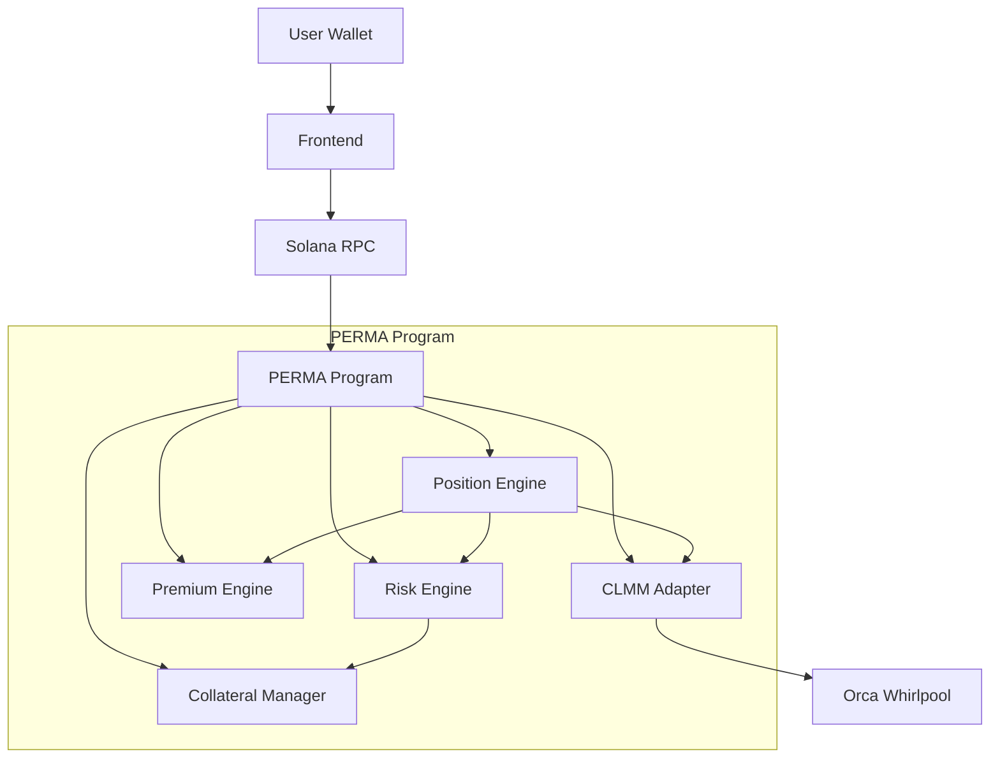

# SYSTEM ARCHITECTURE: PERMA

## High-Level Overview
PERMA is designed as a modular system that bridges Solana's high-performance runtime with the specialized liquidity of Concentrated Liquidity Market Makers (CLMMs). The architecture is split into three primary layers: the **Asset Layer** (Orca), the **Protocol Layer** (PERMA Program), and the **Interface Layer** (Frontend/API).

## Data & Logic Flow

### 1. The Short Cycle (Liquidity Creation)
`User` $\rightarrow$ `Collateral Manager` (Lock Assets) $\rightarrow$ `Position Engine` (Mint Short) $\rightarrow$ `CLMM Adapter` (CPI to Orca) $\rightarrow$ `Orca Whirlpool` (Liquidity Added).

### 2. The Long Cycle (Liquidity Utilization)
`User` $\rightarrow$ `Risk Engine` (Solvency Check) $\rightarrow$ `Position Engine` (Check Inventory) $\rightarrow$ `Market` (Update Inventory) $\rightarrow$ `Position Engine` (Mint Long).

### 3. The Premium Cycle (Streaming)
`GlobalPremiumIndex` $\rightarrow$ Updates via `mint/burn` or `poke` $\rightarrow$ `Position Engine` (Calculates $\Delta$ index) $\rightarrow$ `Burn/Settle` (Distributes P&L).

## Component Interdependency Map

## Key Architectural Decisions

### Why the Adapter Pattern?
By using a `CLMM Adapter`, PERMA is not hard-coded to Orca. Moving to Raydium or a custom CLMM only requires a new adapter implementation, keeping the core `Position Engine` and `Risk Engine` logic unchanged.

### Why the Index-Based Premium?
Updating thousands of position accounts every slot is impossible on Solana. The `GlobalPremiumIndex` allows the protocol to track time-based accrual globally, calculating individual premium only when a position is accessed (Mint/Burn/Query).

### Why a Margin System?
Traditional escrow for full notional value is too capital inefficient. By using a margin-based solvency system, PERMA allows professional traders to leverage their collateral, mirroring the behavior of institutional perpetuals.

---

**🚩 STATUS:** Prototype. Not audited. Single pool. Not production mainnet risk capital.
